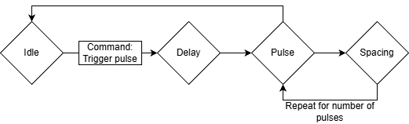
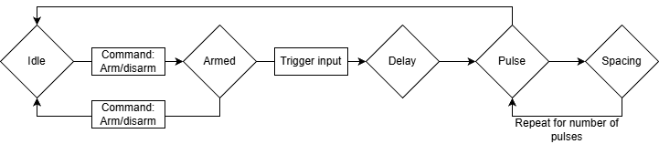
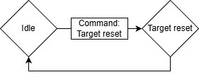
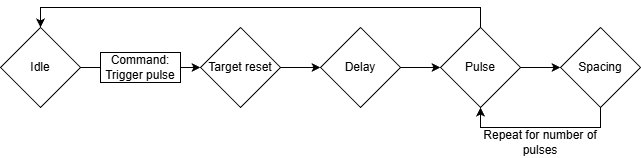
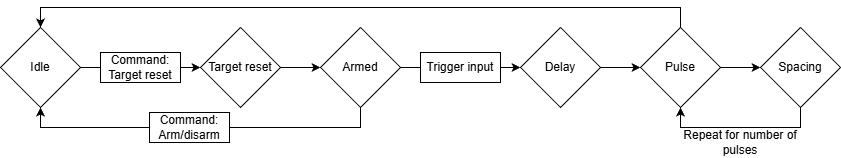

<!---

This file is used to generate your project datasheet. Please fill in the information below and delete any unused
sections.

You can also include images in this folder and reference them in the markdown. Each image must be less than
512 kb in size, and the combined size of all images must be less than 1 MB.
-->

## Introduction

This project is a pulse generator with configurable parameters, intended for use in voltage or electromagnetic fault injection attacks.

Fault injection is a hardware attack technique in which a brief disruption to a microcontroller's power supply or electromagnetic environment creates faults (glitches) that can cause it to skip instructions, corrupt computations, or bypass security checks. This can be used to potentially reveal cryptographic keys, bypass secure boot, or unlock otherwise inaccessible functionality.

In a typical voltage fault injection setup, the target microcontroller's power rail is momentarily pulled low (or sometimes spiked high) for a tiny fraction of a second. If timed correctly, this can cause a single instruction to execute incorrectly or not at all.

Similarly, electromagnetic fault injection (EMFI) uses a coil placed near the target IC to induce transient currents in the die.

In practice, the correct glitch parameters are rarely known in advance. The useful fault parameters often have to be found experimentally by sweeping across different delay values, pulse widths, pulse counts, and pulse spacing values until the target shows an interesting response.

The pulse generator can be configured and controlled over a standard UART serial connection at 115200 baud, making it easy to drive from a microcontroller, a single-board computer like a Raspberry Pi, or a USB-to-serial adapter.

Pulses can be triggered either by UART commands or by the external trigger input.

The pulse generator runs at 50 MHz, giving a timing resolution of 20 ns. This is fine enough for precise, repeatable glitch placement on a wide range of targets.

## Hardware Interface

### Inputs

| Pin    | Signal       | Description |
|--------|--------------|-------------|
| `ui[0]`| Trigger In   | External hardware trigger. When the trigger is armed, a high signal on this pin starts the glitch sequence. |
| `ui[1]`| UART RX      | Serial input from the host (115200 8N1). Connect to your host's TX pin. |

### Outputs

| Pin    | Signal              | Description |
|--------|---------------------|-------------|
| `uo[0]`| UART TX             | Serial output to the host (115200 8N1). Connect to your host's RX pin. |
| `uo[1]`| Pulse Out           | Glitch pulse output, active high. |
| `uo[2]`| Target Reset        | Target power-cycle output, active high. Hold high for the configured reset duration. |
| `uo[3]`| Pulse EN            | Single-cycle strobe, goes high for one clock cycle (20 ns) at the start of each triggered glitch sequence. Useful for oscilloscope triggering. |
| `uo[4]`| Busy                | High whenever the glitcher is executing a sequence (reset, delay, pulse, or spacing). Low only when idle. |
| `uo[5]`| Armed               | High when the hardware trigger input is armed and waiting for a high signal on `ui[0]`. |
| `uo[6]`| Pulse Out or Target Reset  | Active high during both glitch pulse output and target reset. |
| `uio[0]`| Pulse Out (Inverted)| Inverted version of `uo[1]`. Use with active-low circuits or MOSFET drivers that require an inverted input. |
| `uio[1]`| Target Reset (Inverted)| Inverted version of `uo[2]`. |

### External Hardware

The `Pulse Out` (`uo[1]`) output can be used with an N-channel MOSFET or analog multiplexer/switch for voltage fault injection, or connected to a ChipSHOUTER for EMFI.

Use `Pulse Out (Inverted)` (`uio[0]`) when your driver circuit expects an active-low enable signal.

In cases where the pulse output might drive (parts of) a target during reset, the combined `Pulse Out or Target Reset` (`uo[6]`) which is high during both pulse generation and target reset.

To use the `Target Reset` (or `Target Reset (Inverted)`), connect it to a power switch for the entire target.

## UART Protocol

All communication is at 115200 baud, 8N1 (8 data bits, no parity, 1 stop bit). Commands are single bytes, optionally followed by parameter bytes for configuration values. All multi-byte parameters are big-endian (high byte first).

All parameter values are either 8-bit or 16-bit unsigned integers.

All timing values are specified in clock cycles at 50 MHz, where 1 cycle = 20 ns.
The maximum value for an 8-bit parameter is 5.10 µs, while the 16-bit timing parameters go up to 1.31 ms.

### Configuration

Configuration commands only update the stored parameter values.

| Command | Byte  | Parameters          | Default | Description                     |
|---------|-------|---------------------|---------|---------------------------------|
| `d`     | `0x64`| 2 bytes (16-bit)    | `0x0000`| Set delay before first pulse    |
| `w`     | `0x77`| 1 byte (8-bit)      | `0x01`  | Set pulse width                 |
| `n`     | `0x6E`| 1 byte (8-bit)      | `0x01`  | Set number of pulses            |
| `s`     | `0x73`| 2 bytes (16-bit)    | `0x0000`| Set spacing between pulses      |
| `r`     | `0x72`| 2 bytes (16-bit)    | `0x0000`| Set target reset duration       |

### Actions

| Command | Byte  | Parameters          | Default | Description                     |
|---------|-------|---------------------|---------|---------------------------------|
| `t`     | `0x74`| none                | —       | Trigger pulse sequence          |
| `a`     | `0x61`| none                | —       | Toggle arm/disarm               |
| `p`     | `0x70`| none                | —       | Reset (power cycle) target using the configured reset duration. |

### Reset Modes

The reset mode determines what happens after the `Target Reset` command has completed.
By default, a pulse sequence is started directly after resetting the target, but it is also possible to set the armed state and wait for a trigger input, or do nothing at all.

| Command | Byte  | Parameters          | Default | Description                     |
|---------|-------|---------------------|---------|---------------------------------|
| `u`     | `0x75`| none                | —       | Reset mode: Pulse (default)     |
| `i`     | `0x69`| none                | —       | Reset mode: Arm                 |
| `y`     | `0x79`| none                | —       | Reset mode: None                |

### Other

| Command | Byte  | Parameters          | Default | Description                     |
|---------|-------|---------------------|---------|---------------------------------|
| `h`     | `0x68`| none                | —       | Hello! Returns `Erika`          |
| other   | —     | —                   | —       | Unknown commands are echoed back over UART        |

## How It Works

Internally, the glitcher is implemented as a small state machine with five main phases: idle, target reset, delay, pulse active, and pulse spacing. The `Busy` (`uo[4]`) output is high whenever the design is not idle, the `Armed` (`uo[5]`) output is high when the external trigger path is waiting for `Trigger In` (`ui[0]`), and `Pulse EN` (`uo[3]`) generates a one-clock strobe at the moment a pulse sequence starts.

When in the target reset state, the `Target Reset` (`uo[2]`) output is high.

When in the pulse active state, the `Pulse Out` (`uo[1]`) output is high.

### Manual Trigger Over UART

In the simplest use case, the host first configures the pulse parameters over UART and then sends the `t` command to start a sequence immediately. The glitcher waits for the configured delay, generates the requested number of pulses with the configured width and spacing, and then returns to the idle state.



### Arm Over UART, External Trigger Input

For external trigger inputs, the host sends `a` to arm the trigger logic. The glitcher then waits in the idle state with `Armed` (`uo[5]`) high until `Trigger In` (`ui[0]`) goes high, at which point it starts the same delay-and-pulse sequence as a manual UART trigger. Arming is automatically cleared when the sequence begins, so each arm command corresponds to one trigger event.



### Reset Mode: None

When reset mode is set to `None`, the `p` command only asserts `Target Reset` (`uo[2]`) for the configured reset duration. After that time has passed, the glitcher returns directly to idle without generating any pulse sequence and without arming the external trigger input.



### Reset Mode: Pulse

When reset mode is set to `Pulse`, the `p` command first resets the target and then automatically starts the configured pulse sequence. After reset is released, the normal pulse delay is still applied before the first pulse, which makes it possible to place the glitch at a controlled offset relative to the end of the reset interval.

This is the default reset mode.



### Reset Mode: Arm

When reset mode is set to `Arm`, the `p` command resets the target and then returns to idle with the trigger logic armed. This is useful when the target should be reset first, but the actual glitch should not occur until a later external event on `Trigger In` (`ui[0]`).



## How to Test

The project can be tested by connecting a microcontroller or USB-to-serial adapter to the UART RX and TX pins (`ui[1]` and `uo[0]`, respectively).

First test that the UART works by sending `x` (hex byte `78`), which should be echoed back because it is an unknown command, or `h` which should return the string `Erika`.

To test a basic pulse, set the pulse width to 100 clock cycles with `w\x64` (hex bytes `77 64`) and trigger the pulse with `t` (hex byte `74`). This should result in a pulse on the Pulse Out pin (`uo[1]`).

To test trigger arming, send `a` (hex byte `61`). This should make the armed pin (`uo[5]`) go high.
Sending `a` again should disarm the trigger. While armed, setting the trigger input pin (`ui[0]`) to high will trigger a pulse.

See the cocotb tests for more examples.

Alternatively, the RP2350 running MicroPython on the demo board can be used to test basic functionality.
First, set `mode = ASIC_RP_CONTROL` in `config.ini` (or manually in the REPL) to allow the RP2350 to drive the project inputs.

To use UART from the MicroPython REPL, initialize it like this:
```python
>>> from machine import UART
>>> uart = UART(0, baudrate=115200, tx=tt.pins.ui_in1.raw_pin, rx=tt.pins.uo_out0.raw_pin)
>>> _ = uart.read() # Clear read buffer
```

The `h` command will verify that the project is running:
```python
>>> uart.write(b'h')
1
>>> uart.read()
b'Erika'
```

Unknown commands are echoed back directly:
```python
>>> uart.write(b'x')
1
>>> uart.read()
b'x'
```

The `armed` signal can be found on `uo[5]`, and the trigger input is on `ui[0]`.
Here is a quick sanity check for these:
```python
>>> tt.uo_out[5]     # Check if armed (0 = not armed, 1 = armed)
<Logic ('0')>
>>> uart.write(b'a') # Arm trigger
1
>>> tt.uo_out[5]     # Trigger is now armed
<Logic ('1')>
>>> tt.ui_in[0] = 1  # Set the trigger input
>>> tt.uo_out[5]     # No longer armed
<Logic ('0')>
```

## Acknowledgments and Similar Projects

This project had several sources of inspiration, including:

* The ["NXP LPC1343 Bootloader Bypass"](https://toothless.co/blog/bootloader-bypass-part1) series of blog posts by Dmitry Nedospasov  was where I first saw this type of glitcher implemented in an FPGA.
* The [Wallet.fail](https://wallet.fail/) presentation at 35C3 ([watch the presentation on YouTube](https://www.youtube.com/watch?v=Y1OBIGslgGM)), by Thomas Roth, Dmitry Nedospasov, and Josh Datko, used a very similar FPGA glitcher.
* ... and so did the [Chip.Fail](https://www.youtube.com/watch?v=CX71p_qcCxY) presentation at Black Hat USA 2019, by Thomas Roth and Josh Datko. The code for this can be found on [GitHub](https://github.com/chipfail/chipfail-glitcher).
* I attended one of Dmitry's in-person "Hardware hacking with FPGAs" trainings in 2019 as well, which was also a great source of inspiration.

If you are looking for fault injection tooling that works out-of-the-box, also check out the [ChipWhisperer](http://chipwhisperer.com/) by Colin O'Flynn (NewAE Technology) or the [Faultier](https://1bitsquared.com/products/faultier) by Thomas Roth (Hextree.io).